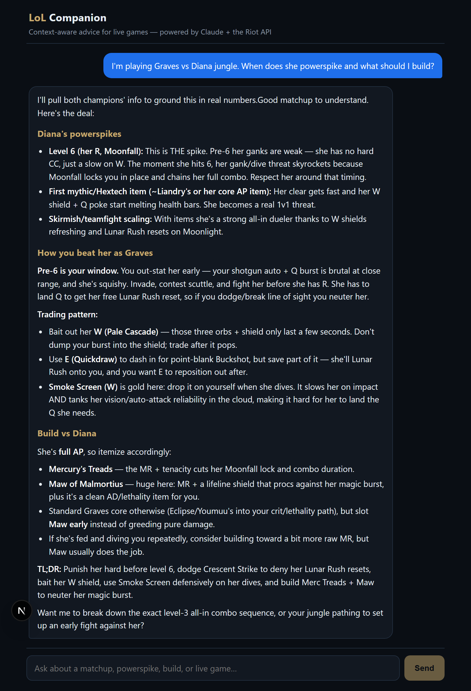
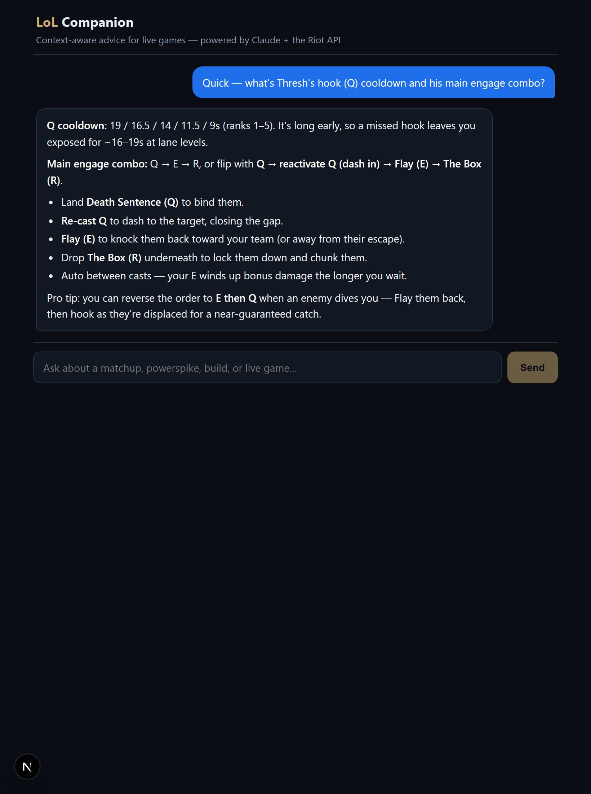
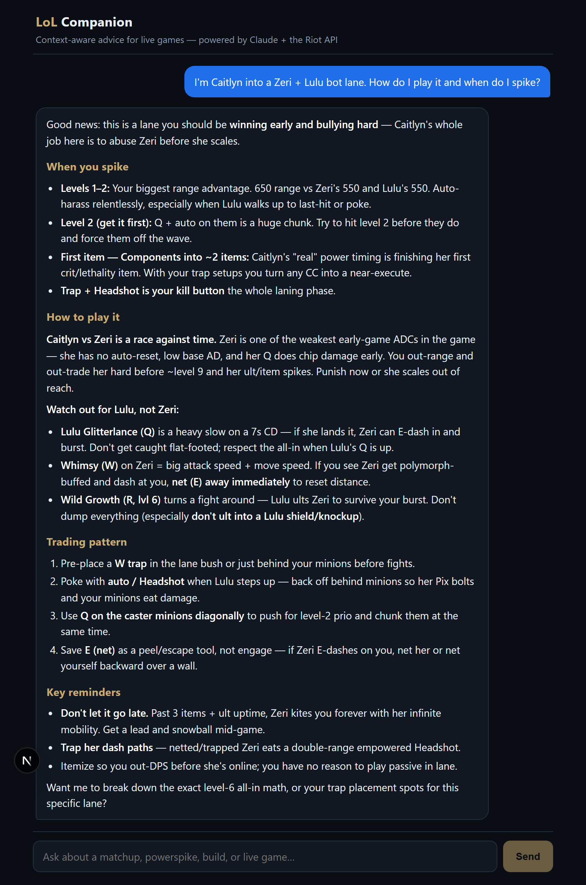

# 🎮 LoL Companion

A real-time **League of Legends chatbot companion**. Ask context-aware questions before or during a live game — *"I'm Graves vs Diana jungle, when does she powerspike and what should I build?"* — and get advice grounded in **real champion data and your live match**, not the model's memory.

Built on a decentralized **Model Context Protocol (MCP)** architecture: a Python MCP server wraps the Riot API + Data Dragon, and a Next.js chat client runs a Claude tool-use loop that calls those tools to answer.

---

## ✨ What it looks like

> Claude narrates what it's doing, calls the data tools, and answers with real cooldowns, powerspikes, and build paths.



| Champion deep-dive | Lane matchup |
|---|---|
|  |  |

---

## 💬 Example questions

**Matchups & powerspikes**
- *"I'm playing Graves vs Diana jungle. When does she powerspike and what should I build?"*
- *"I'm Caitlyn into a Zeri + Lulu bot lane. How do I play it and when do I spike?"*
- *"Quick — what's Thresh's hook (Q) cooldown and his main engage combo?"*

**Live games** (needs a Riot ID like `Name#TAG`)
- *"Who is `Faker#KR1` playing against right now?"*
- *"I'm in a game as `MyName#NA1` — what are the biggest threats on the enemy team?"*

Here's a real live-match answer — note it lists the **actual enemy comp**, flags the jungler (the only role the live API exposes), and **asks your lane** instead of guessing:

```
You're on Veigar (red side). Here's the enemy (blue) team you're up against:
- Shaco
- Lulu
- Akshan
- Rek'Sai — Jungler (has Smite)
- Zeri

Biggest threats to watch:
- Rek'Sai + Shaco is a scary early-game gank duo...
- Akshan punishes you stepping up without your E (Event Horizon) ready...

Since Riot's live data doesn't give lane assignments, I won't guess who you're
laning against. Which lane are you in? Tell me and I'll break down the matchup.
```

---

## 🏗 Architecture

```
┌──────────────────────────────┐         ┌─────────────────────────────┐
│  Web Client (Next.js / TS)   │         │  LoL MCP Server (Python)    │
│                              │         │                             │
│  app/page.tsx   ── chat UI   │         │  FastMCP over stdio         │
│       │                      │         │   ├─ get_champion_info      │
│  app/api/chat/route.ts       │  stdio  │   └─ get_live_match_context │
│   Claude tool-use loop  ─────┼────────▶│                             │
│   (claude-opus-4-8,          │ JSON-RPC│   Data Dragon (CDN, cached) │
│    adaptive thinking,        │         │   Riot API (Account+Spectator)│
│    streams SSE to browser)   │         │                             │
└──────────────────────────────┘         └─────────────────────────────┘
```

The client hosts the Claude chat loop and acts as the **MCP client**; the Python server is a standalone **MCP server**. They communicate over the MCP **stdio** transport (JSON-RPC). When Claude decides to call a tool, the client executes it against the server and feeds the result back into the conversation.

### The MCP tools

| Tool | Data source | Returns |
|---|---|---|
| `get_champion_info(champion_name)` | Data Dragon (public CDN — no API key) | Base stats + per-level growth, full ability kit with cooldowns/costs, and powerspike/matchup cues |
| `get_live_match_context(summoner_name, tag_line)` | Riot Account-V1 → Spectator-V5 | Both teams' champions, the jungler (inferred via Smite), and bans for a player's current game |

---

## 📁 Project structure

```
Matchup_chatbot/
├─ lol-mcp-server/                 # Python MCP server (Phase 1)
│  ├─ src/lol_mcp_server/
│  │  ├─ server.py                 # FastMCP app + tool registrations
│  │  ├─ config.py                 # env-driven config
│  │  ├─ logging_setup.py          # stderr-only logging (protects stdio JSON-RPC)
│  │  ├─ data_dragon.py            # Data Dragon client + TTL cache
│  │  ├─ riot_api.py               # Account-V1 + Spectator-V5 client
│  │  └─ formatting.py             # raw payloads → LLM-friendly markdown
│  └─ pyproject.toml
├─ web-client/                     # Next.js chat client (Phase 3)
│  ├─ app/page.tsx                 # single-page chat UI (streaming bubbles)
│  ├─ app/api/chat/route.ts        # Claude agentic loop + SSE
│  └─ lib/mcp.ts                   # stdio MCP client + tool bridge
└─ docs/screenshots/
```

---

## 🚀 Setup

Prereqs: **Python 3.11+** with [`uv`](https://docs.astral.sh/uv/), **Node 20+**, a [Riot API key](https://developer.riotgames.com/), and an [Anthropic API key](https://console.anthropic.com/).

### 1. MCP server

```bash
cd lol-mcp-server
uv sync
cp .env.example .env          # add RIOT_API_KEY (only needed for live-match)
```

Smoke-test it with the MCP Inspector:

```bash
npx @modelcontextprotocol/inspector uv run lol-mcp-server
```

### 2. Web client

```bash
cd web-client
npm install
cp .env.local.example .env.local   # add ANTHROPIC_API_KEY
npm run dev                         # http://localhost:3000
```

The client launches the Python server automatically over stdio — you don't run it separately.

> **Windows note:** if the child-process spawn can't resolve `uv`, set `LOL_MCP_COMMAND` in `.env.local` to the absolute `uv.exe` path.

---

## ⚙️ How it works

1. The browser POSTs the chat history to `/api/chat`.
2. The route opens a streaming loop with **`claude-opus-4-8`** (adaptive thinking), passing the MCP tools as Anthropic tool definitions.
3. When Claude emits a `tool_use`, the route calls the tool over the stdio MCP connection, returns the result, and continues — up to 8 turns — until Claude stops calling tools.
4. Text deltas and tool-status events stream back to the browser as Server-Sent Events.

**Caching keeps it fast and rate-limit-friendly:** static champion data is pulled once from Data Dragon and held in a TTL cache; the MCP connection is reused across requests.

---

## ⚠️ Known limitations

- **No lane assignments in live games.** Riot's Spectator API returns champions and teams but *not* who's top/mid/bot. The companion infers only the **jungler** (via Smite) and asks you which lane you're in rather than guessing — so it won't mislabel an off-meta pick (e.g. Veigar bot).
- **Riot dev keys expire every 24h.** Regenerate at the developer portal; champion-info questions work without a key (Data Dragon is public).

---

## 🗺 Roadmap

- [x] Phase 1 — Local MCP server (champion + live-match tools)
- [x] Phase 2 — MCP Inspector testing
- [x] Phase 3 — Next.js chat client (Claude loop + MCP over stdio)
- [x] Markdown rendering in chat bubbles
- [ ] Phase 4 — Refactor server to **Streamable HTTP** MCP for cloud deployment (Render/Railway/Vercel)
- [ ] Optional `lane` hint to skip the "which lane?" step
- [ ] Counter-stats / win-rate tool

---

## 🛠 Tech stack

**Server:** Python · [FastMCP](https://github.com/jlowin/fastmcp) · httpx · Riot API · Data Dragon
**Client:** Next.js 15 · React 19 · TypeScript · [Anthropic SDK](https://github.com/anthropics/anthropic-sdk-typescript) · [`@modelcontextprotocol/sdk`](https://github.com/modelcontextprotocol/typescript-sdk)
**Model:** Claude Opus 4.8

---

*Not affiliated with or endorsed by Riot Games. League of Legends is a trademark of Riot Games, Inc.*
